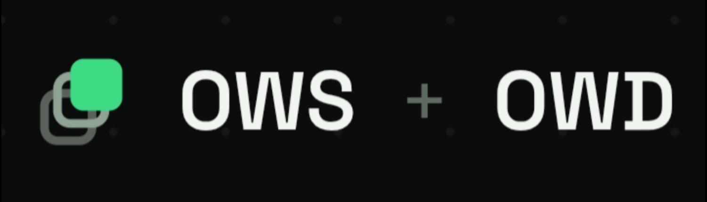

# OWS + OWD

<p align="center">
  
</p>

<p align="center">
  
</p>

<p align="center">
  <b>Overlay Widget Script + Overlay Widget Design</b><br>
  Draw over everything.
</p>

A small language for building interactive widgets that can live as overlays (draw over other apps), with a clean split between logic and design.

- **OWS** — imperative logic (events, state, classes, API calls)
- **OWD** — declarative design (layout, style, looks)

```ows
attach src = "widget.owd"
number count = 0

when Plus.clicked {
    count = count + 1
    Counter.txt = "Count: " + str(count)
}
```

```owd
Widget CounterRoot {
    width: 260
    height: 160
    background: "#151515"

    Text Counter { txt: "Count: 0"  size: 28  x: 16  y: 24 }
    Button Plus  { txt: "+"  x: 190  y: 90  width: 50  height: 48 }
    Button Minus { txt: "-"  x: 16   y: 90  width: 50  height: 48 }
}
```

---

## Downloads

| Package | Description | Link |
|--------|-------------|------|
| **CLI** | Headless + overlay command-line tool (`ows` / `ows.bat`) | https://github.com/Abhi13-coder/Ows-owd/releases#release-Language

---

## What’s in v1.0

| Works | Not yet |
|-------|---------|
| Overlay widgets | Images / GIFs |
| Shape-shifting | Audio |
| Button clicks & class events | Wallpaper / lock-screen binding |
| Animations (inside widget + overlay itself) | Package system |
| Online API calls | Offline AI |
| Classes | Built-in exception handling |
| Headless CLI + overlay path | Video, PiP, sensors / HUDs |

---

## Quick start (CLI)

### 1. Get the CLI

Download the **CLI** package from [Releases](https://github.com/Abhi13-coder/OWS-OWD/releases) (see Downloads table above).

Unzip. You should have:

```
ows          # Unix / Linux / macOS
ows.bat      # Windows
```

### 2. Write a widget

Create two files in the same folder:

**main.ows**
```ows
attach src = "widget.owd"
number count = 0

fun formatCount(n) {
    return "Count: " + str(n)
}

when Plus.clicked {
    count = count + 1
    Counter.txt = formatCount(count)
}

when Minus.clicked {
    count = count - 1
    if count < 0 { count = 0 }
    Counter.txt = formatCount(count)
}
```

**widget.owd**
```owd
Widget CounterRoot {
    width: 260
    height: 160
    radius: 24
    background: "#151515"

    Text Counter {
        txt: "Count: 0"
        size: 28
        x: 16
        y: 24
    }

    Button Minus {
        txt: "-"
        x: 16
        y: 90
        width: 50
        height: 48
        radius: 12
        background: "#333333"
    }

    Button Plus {
        txt: "+"
        x: 190
        y: 90
        width: 50
        height: 48
        radius: 12
        background: "#1E88E5"
    }
}
```

### 3. Run

```bash
# Headless (no GUI) — compiles and registers handlers
ows run main.ows

# Request an overlay through the Host Manager
ows run overlay main.ows
```

**Attach rules**
- Explicit: `attach src = "widget.owd"` always wins when present
- If you omit `attach`, the runtime auto-picks a sibling `.owd` next to the `.ows`

---

## Project layout

```
OWS_OWD_Project/
├── ows-core/     # Language engine (lexer, parser, AST, compiler, IR, VM, host, scene, render)
├── ows-cli/      # Headless / overlay CLI
└── app/          # Android app (overlay service, preview, editor pieces)
```

Samples:

```
app/src/main/assets/samples/
├── counter/
│   ├── main.ows
│   └── main.owd
└── api_demo/
    ├── main.ows
    └── main.owd
```

---

## Language at a glance

**OWS (logic)** — imperative  
Events (`when Plus.clicked`), variables, functions, classes, control flow, API calls (`http.get_async` / `http.post_async`).

**OWD (design)** — declarative  
Widget tree, properties (`width`, `height`, `background`, `txt`, `x`, `y`, …). No behaviour mixed in.

---

## Host manager

A built-in host manager detects where the script is running and adapts (Android overlay permission, Linux/Windows desktop, VMs, proot / fake hosts). You don’t call it; it works in the background.

---

## Roadmap

| Version | Focus |
|---------|--------|
| **v1.0** | Core overlays, events, animation, API, classes, CLI |
| **v1.1** | Images/GIFs, audio, wallpaper & lock-screen, packages (`ows install` / `owd install`) |
| **v1.2** | Exception handling + video in overlays |
| **v1.3** | PiP + visual assistant guides & example package |
| **v1.4** | Offline AI pipeline + RAM-tiered ML libraries |
| **v1.5** | Databases, sensor radar, HUDs |

---

## Who it’s for

People who want interactive UI that stays on screen — overlays, desktop companions, stream HUDs, screen pets, always-on helpers — without building a full traditional app for every surface.

---

## Status

**v1.0** — first public preview. Core works. Media, packages, offline AI, and advanced surfaces are planned, not claimed as done.

Feedback and issues welcome.

---

## License

See repository for license details.
